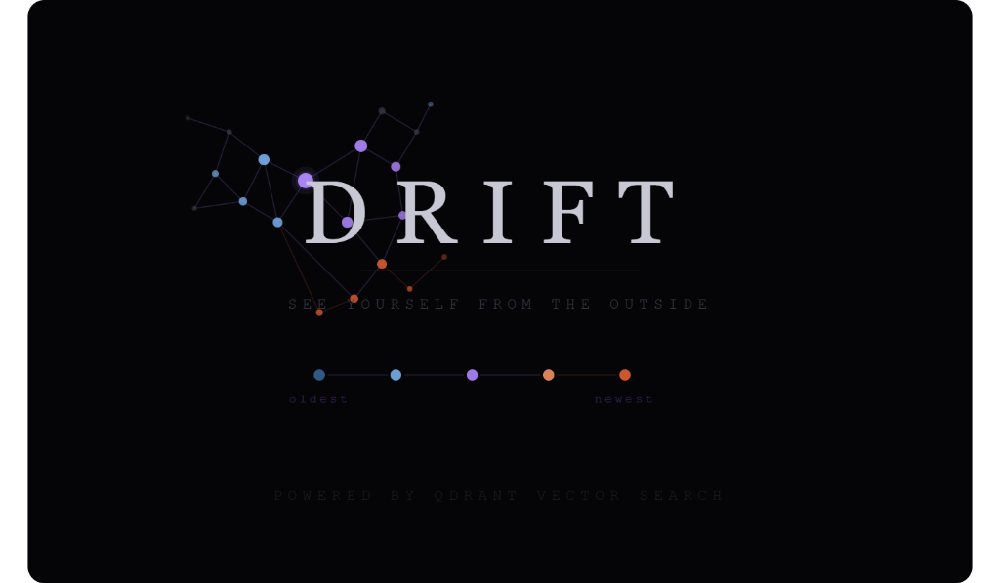

# DRIFT
### *A mirror that shows you who you are becoming.*

> A vector-space journal that reveals the hidden shape of how your mind moves — built for the Qdrant "Think Outside the Bot" Hackathon, Vector Space Day 2026.

---

## What is DRIFT?

Every thought you have has a shape. Every feeling has a neighbor in semantic space.

DRIFT is a personal thinking journal where every entry (written or spoken) is embedded into a 384-dimensional vector space and rendered as a **living 3D constellation**. Over time, the space fills with your thinking — and the space itself becomes a record not of *what* you said, but of the hidden shape of how your mind moves.

**This is not a chatbot. There is no chat interface. The vector search IS the product.**

### What the constellation shows you:

- **When you changed** — the moment your points start clustering somewhere new
- **What you keep returning to** — tight clusters are your anchors, your unresolved things
- **Your singular moments** — isolated outlier points, the days you were most alone in your thinking
- **Hidden echoes** — two entries far apart in time that land beside each other in vector space, because the model knew something you didn't

---

## Demo

[3-minute demo video →](#)

---

## Tech Stack

| Layer | Technology |
|---|---|
| Vector DB | **Qdrant Cloud** |
| Embeddings | `sentence-transformers/all-mpnet-base-v2` (384-dim) |
| Transcription | OpenAI Whisper API |
| Backend | FastAPI (Python) |
| Frontend | Next.js 14 + Three.js + Framer Motion |
| 3D Projection | Custom PCA (384D → 3D) |

---

## How Qdrant is Used

- **Collection:** `drift_entries` — 384-dimensional cosine distance vectors
- **Upsert:** every new entry stored with full metadata payload
- **Scroll:** retrieve all entries for constellation rendering
- **Search:** nearest-neighbor similarity search to find "echo" entries
- **Payload filtering:** timeline range filtering by timestamp

The entire core loop — store, retrieve, search — runs through Qdrant. Without Qdrant, DRIFT doesn't exist.

---

## Setup & Installation

### Prerequisites
- Python 3.11+
- Node.js 18+
- [Qdrant Cloud account](https://cloud.qdrant.io) (free tier works)
- OpenAI API key (for Whisper; text-only mode works without it)

### Backend

```bash
cd backend
cp .env.example .env
# Fill in QDRANT_URL, QDRANT_API_KEY, OPENAI_API_KEY

pip install -r requirements.txt
uvicorn main:app --reload
```

The server starts on `http://localhost:8000`.

### Seed demo data (recommended for judges)

```bash
cd backend
python seed.py
```

This loads 40 carefully crafted entries that form a visually compelling constellation with clear clusters, outliers, and "echo pairs" — two entries from different time periods that land right next to each other in vector space.

### Frontend

```bash
cd frontend
cp .env.local.example .env.local
# Set NEXT_PUBLIC_API_URL=http://localhost:8000

npm install
npm run dev
```

App starts on `http://localhost:3000`.

---

## Pages

| Route | Description |
|---|---|
| `/` | Landing page — animated, explains the concept |
| `/journal` | New entry page — text or voice input |
| `/constellation` | 3D visualization — the main experience |

---

## Using the Constellation

- **Drag** to rotate the constellation in 3D
- **Scroll** to zoom in/out
- **Click any point** to read the entry
- **"Find similar entries"** triggers Qdrant nearest-neighbor search and draws connecting lines to echo entries
- **Color = time**: blue = oldest, purple = middle, orange = newest

---

## Architecture

```
User writes/speaks
       ↓
FastAPI backend
       ↓
sentence-transformers (384-dim embedding)
       ↓
Qdrant (upsert vector + payload)
       ↓
Frontend fetches all vectors
       ↓
PCA reduction: 384D → 3D
       ↓
Three.js renders constellation
       ↓
Click → Qdrant similarity search → echo lines
```

---

## Project Structure

```
drift/
├── backend/
│   ├── main.py          # FastAPI routes
│   ├── embeddings.py    # sentence-transformers
│   ├── qdrant_client.py # Qdrant operations
│   ├── transcribe.py    # Whisper API
│   ├── models.py        # Pydantic schemas
│   ├── seed.py          # Demo data loader
│   └── requirements.txt
│
├── frontend/
│   └── src/
│       ├── app/
│       │   ├── page.tsx              # Landing
│       │   ├── journal/page.tsx      # Entry input
│       │   └── constellation/page.tsx # 3D viz
│       └── lib/
│           ├── api.ts                # Backend client
│           └── pca.ts                # PCA projection
│
└── README.md
```

---

## The Core Insight

Most applications use vector search to find things — documents, products, answers. DRIFT uses vector search to **reveal structure** — the hidden geometry of a person's thinking over time. Proximity in the space isn't just similarity; it's a form of self-knowledge that no other medium can provide.

This is what Qdrant makes possible. Not search. **Revelation.**

---

*Built for the Qdrant "Think Outside the Bot" Hackathon · Vector Space Day 2026*
